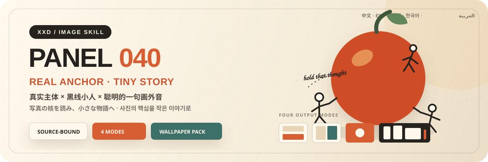
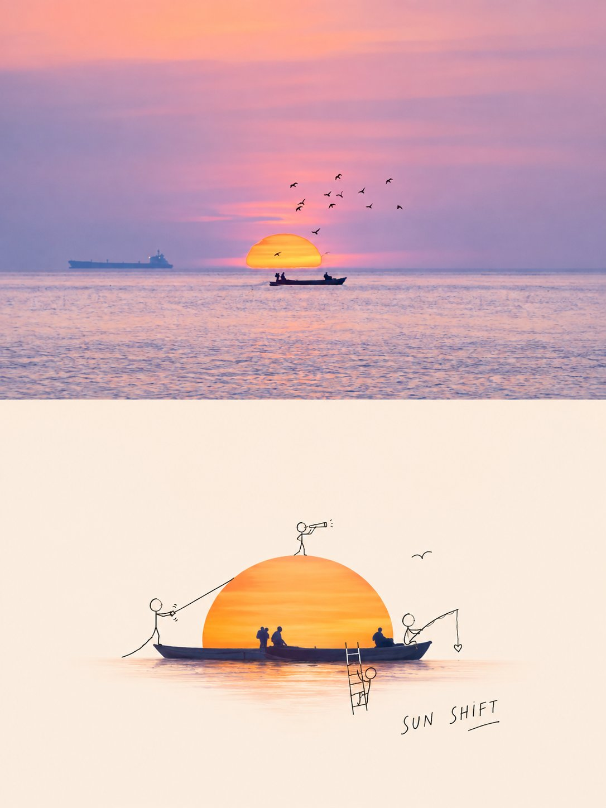
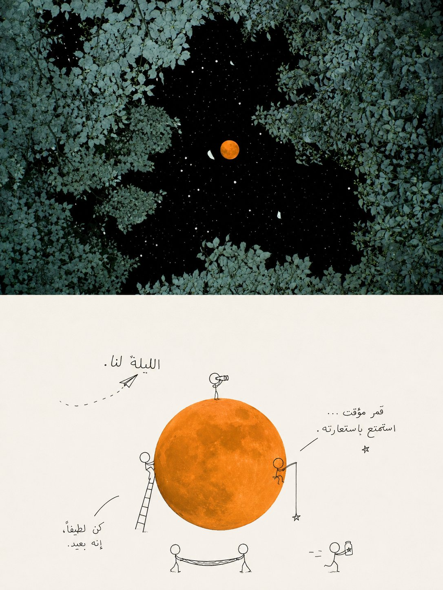
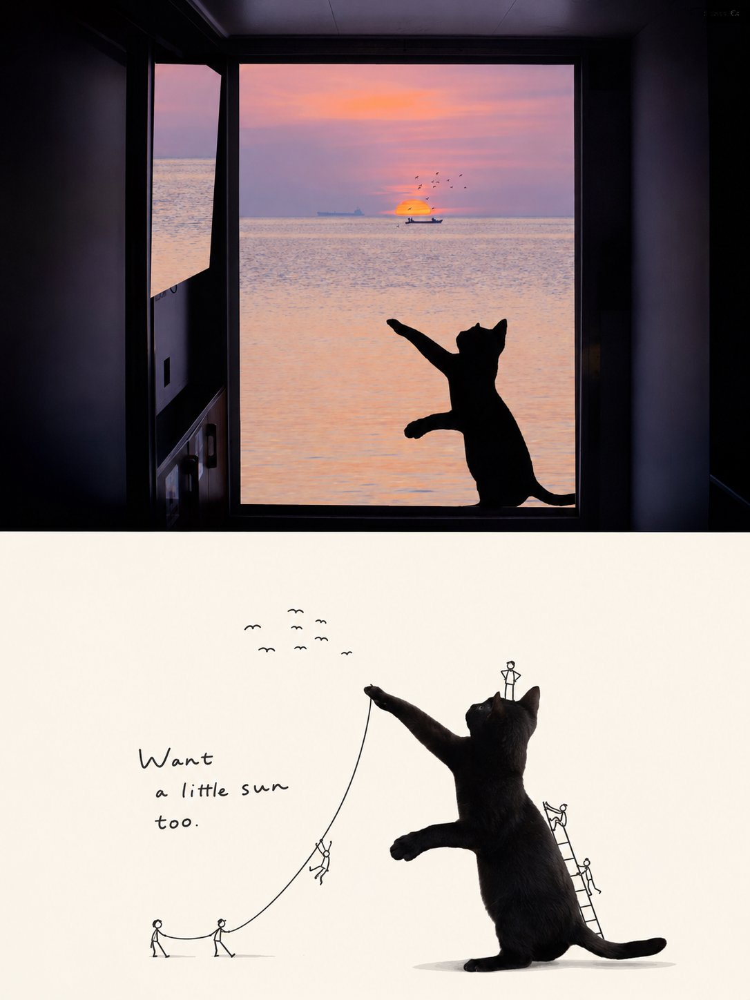

<p align="center">
  
</p>

<div align="center" dir="rtl">

# 🦁 XXD Panel 040

### يحوّل ما تقوله الصورة حقاً إلى مرساة واقعية وحكاية صغيرة مرسومة بخطوط سوداء

[](./SKILL.md)
[](#أربعة-مخرجات-ومنطق-سردي-واحد)
[](#الحدود-والثقة)

<a href="README.md">简体中文</a> · <a href="README.en.md">English</a> · <a href="README.ja.md">日本語</a> · <a href="README.ko.md">한국어</a> · <strong>العربية</strong>

</div>

<div dir="rtl">

> موضوع واقعي · شخصيات بخط أسود · سرد مصغّر · فراغ واسع

XXD Panel 040 مهارة لتوليد الصور مخصّصة لـ Codex والوكلاء المتوافقين. لا تضيف رسوماً لطيفة إلى الصورة بصورة آلية؛ بل تحدد أولاً ما يستحق أن يبقى في الذاكرة، ثم تحفظ مرساة بصرية واحدة حقيقية وذات مادة واضحة، وتجعل عدداً قليلاً من الشخصيات المرسومة بخط أسود يستجيب لقصة الصورة أو يضخّمها أو يقلب معناها برفق.

وتنشأ العبارة من المعنى نفسه، كأنها ملاحظة كتبتها إحدى الشخصيات أو فكرة عابرة أو صوت من خارج الكادر.

## لماذا توجد 040؟

يتحوّل أسلوب «عنصر واقعي＋شخصيات مرسومة» بسهولة إلى قالب ملصقات عام: تتسلق الشخصيات وتجلس وتلوّح مهما كان محتوى الصورة، ويصبح أكبر عنصر مقصوص هو البطل، بينما يكتفي النص بتسمية الشيء أو بعبارة تحفيزية.

تعكس 040 هذا الترتيب:

```text
قراءة الوقائع ← اكتشاف العلاقة ← تكثيف الدلالة ← اختيار المرساة الواقعية ← تصميم التفاعل ← كتابة الصوت الخارج عن الكادر
```

إذا أمكن استبدال المصدر بصورة لا صلة لها من دون تغيير جوهري في المرساة أو حركة الشخصيات أو العلاقة المكانية أو اللون أو النص، فالنتيجة ليست 040.

## العقد البصري لـ 040

- **مرساة واقعية:** تحافظ على المصداقية الفوتوغرافية وهوية المادة والخط الخارجي الحاسم ولون المصدر الرئيس، من دون تحويل الموضوع إلى رسم كرتوني.
- **ثلاث إشارات هوية على الأقل:** الخط الخارجي، الوضعية، الاتجاه، النسبة، المادة، اللون، الفتحة، الشكل السلبي أو مسافة العلاقة تجعل المصدر قابلاً للتعرّف.
- **من شخصية إلى خمس شخصيات بخط أسود:** خطوط رفيعة وبسيطة قليلاً، لكن الحركة واضحة؛ ولكل إيماءة وظيفة في معنى الصورة.
- **تفاعل لا لصق:** تستخدم الشخصيات حافة المرساة أو فتحتها أو سطحها أو اتجاهها أو مقياسها كمسرح فعلي.
- **لون من المصدر وحقل فاتح:** تحمل المرساة اللون الرئيس، وتمنح الخلفية الفاتحة المريحة تبايناً واضحاً للخط الأسود أو الرمادي الداكن.
- **فراغ فعّال:** يبقى التكوين خفيفاً ودقيقاً وقابلاً للتنفس، من دون زخرفة كثيفة.
- **عبارة داخل المشهد:** تعمل الكلمات كملاحظة أو فكرة أو صوت خارج الكادر يكمل حركة الشخصيات.

## نماذج · من X

> [Xiaoxiaodong (@xiaoxiaodong01)](https://x.com/xiaoxiaodong01/status/2090834371423183135) · 21 أغسطس 2026<br>
> GPT2 × شخصيات صغيرة مرحة × تبسيط × توجيه جمالي × VOL.040<br>
> لا تظهر الشخصيات لمجرد إضفاء اللطافة؛ بل تمثل منظوراً آخر داخل الصورة، فتستجيب للمشهد أو تعلّق عليه أو تنطق بما تركه من دون قول.

<table>
  <tr>
    <td width="50%"><a href="https://x.com/xiaoxiaodong01/status/2090834371423183135"></a></td>
    <td width="50%"><a href="https://x.com/xiaoxiaodong01/status/2090834371423183135"></a></td>
  </tr>
  <tr>
    <td width="50%"><a href="https://x.com/xiaoxiaodong01/status/2090834371423183135"></a></td>
    <td width="50%"><a href="https://x.com/xiaoxiaodong01/status/2090834371423183135"></a></td>
  </tr>
</table>

<p align="center"><a href="https://x.com/xiaoxiaodong01/status/2090834371423183135">عرض المنشور الأصلي والتوجيه كاملاً ←</a></p>

توضح هذه النماذج الدافع الجمالي لـ 040، ولا تجعل موضوعاتها أو أفعال الشخصيات أو ألوانها أو نصوصها أو نسبة اللوحة القديمة مراجع للتوليد أو قيماً افتراضية حالية.

## الموجّه الأصلي هو المرجع الجمالي الوحيد

الملف `references/040-source.md` هو المرجع الإبداعي والجمالي الوحيد للمشروع. لا تلخّص المهارة نصّه ولا توسعه، ولا تفرض لوحة ألوان مشتركة أو «دافعاً جمالياً» أو عنواناً أو حزمة نصوص قصيرة. يتبع GPT Image 2 قواعد الموجّه الأصلي نفسه في اللون والخامة والتكوين والفراغ والنص والطباعة.

يستبدل النمط والحجم حاوية الإخراج القديمة 3:4 ذات الجزأين العلوي والسفلي استبدالاً كاملاً، من دون تغيير جمالية التحويل الأصلية. يُرسَل إلى GPT Image 2 عقد النمط المختار فقط لكل نتيجة، بدلاً من وضع الأنماط الأربعة كبدائل داخل قالب عام واحد.

## أربعة مخرجات قابلة للجمع

يمكن اختيار واحد أو أكثر من `top-bottom` و`left-right` و`design-only` و`wallpaper-pack`. وعند اختيار أكثر من نمط، يُولَّد كل نمط مستقلاً بموجّه خاص به.

- `top-bottom`: لوحة كاملة يكون فيها المشهد الواقعي في الأعلى والتحويل التصميمي في الأسفل.
- `left-right`: بنية يسار／يمين تمتد من أعلى اللوحة إلى أسفلها، المصدر يساراً والتصميم يميناً، وتندمج الكتابة داخلها؛ ويمكن أن تكون العروض غير متماثلة.
- `design-only`: يبقى المصدر مرجعاً غير مرئي، وتتبع كل العناصر المرئية لغة التحويل الخاصة بالـ Panel.
- `wallpaper-pack`: تُعاد صياغة خلفية كاملة لكل جهاز من التحويل التصميمي وحده.

لا يُقاس خط فصل أو منتصف أو إحداثيات بكسل. ولا يُستخدم الدمج الحتمي إلا بطلب صريح لهندسة دقيقة أو حفظ بكسلات المصدر.

يمكن أيضاً اختيار عدة أحجام: ملاءمة تلقائية، نسبة المصدر، 1:1، 3:4، 4:3، 4:5، 5:4، 2:3، 3:2، 9:16، 16:9، 21:9، 5:7، 7:5، أو نسبة مخصصة／أبعاد بكسل دقيقة. لا يوجد حجم افتراضي صامت، وتُعاد صياغة كل نسبة مختلفة بصورة مستقلة من الموجّه الأصلي نفسه.

حزمة الخلفيات إما مترابطة أو مستقلة. في الحزمة المترابطة تُنشأ صورة مرجعية أولى، ثم يُعاد تكوين كل جهاز من المصدر الأصلي مع تلك الصورة؛ ولا تُقص صورة واحدة آلياً إلى أربعة أحجام.

## أوضاع النص

قبل التوليد يُحسم خيار واحد:

1. **ينشئ النموذج النص وفق الموجّه الأصلي**: يحدد المستخدم اللغة أو المنطقة فقط، وتتولد الكلمات من محتوى الصورة الحالية أو أجوائها أو دلالتها. وكل معلومة تبدو واقعية أو توثيقية يجب أن تستند إلى ما قدّمه المستخدم أو ما يظهر بوضوح في الصورة أو إلى حقائق تم التحقق منها.
2. **استخدام نصي الحرفي**: يُمرر كما هو بلا إعادة صياغة أو ترجمة أو عنوان إضافي، مع بقاء الطباعة خاضعة للموجّه الأصلي.
3. **بلا نص**: يُمنع كل نص أو شبه نص.

لا تكتب المهارة الخارجية عنواناً أو نصوصاً قصيرة مسبقاً. تُحسم لغة الإخراج مستقلة عن لغة الواجهة، ولا تُستنتج من الشخص أو المشهد أو اسم الملف.

## أولوية اللوحة الكاملة وحدود الصورة النقطية

يتولى نموذج الصور إعادة البناء الجمالي للعمل النهائي كله، وتستخدم التركيبات الثنائية أيضاً توليد لوحة كاملة واحدة افتراضياً. ولا يبقى `scripts/compose_panel.py` إلا للاسترداد المشروط ومعايرة البكسلات بلا فقد والتدقيق للقراءة فقط؛ فلا يعمل مسبقاً ولا يحكم على النجاح الجمالي.

كل التسليمات ملفات PNG نقطية، وينشئ كل استدعاء مهمة جديدة تحت `~/Desktop/xxd/`. ولا يكشف مسار الصور المضبوط سوى حالة منزوعة التفاصيل، من دون المزوّد أو نقطة الاتصال أو بيانات الاعتماد أو الرؤوس أو التوجيهات أو الاستجابات أو معلومات الحساب. ولا تصلح SVG أو HTML أو Canvas أو الرسوم البرمجية بديلاً للعمل النهائي.

## أسئلة تتكيّف مع قدرات المضيف ومعاملات مضمنة

تتكيّف المهارة نفسها مع أدوات التفاعل المتاحة فعلياً، ولا تعرض رموزاً زخرفية كما لو كانت عناصر قابلة للنقر:

- **عندما يوفّر Claude Code ‏`AskUserQuestion + multiSelect: true`**: تستخدم الأنماط والأحجام مربعات اختيار حقيقية، ويستخدم نمط النص وعلاقة الخلفيات اختياراً منفرداً. تُقسّم الأحجام الشائعة إلى مربع وعمودي وأفقي، وتتراكم الاختيارات، وتُدخل القيم المخصصة بحرية.
- **عندما لا يوفّر Codex سوى `request_user_input`**: يُستخدم فقط للحقول المتنافية مثل نمط النص وعلاقة الخلفيات. لا تُعرض الأنماط أو الأحجام كاختيار منفرد، بل تُجمع بإدخال تركيبي واضح.
- **عند غياب أداة تفاعلية**: تُستخدم جولتان نصيتان؛ الأنماط أولاً، ثم الأحجام مع نمط النص. لا تظهر مربعات `- [ ]` زائفة، ولا يُطلب الانتقال إلى Plan mode لمجرد الحصول على نموذج.

تعرض الجولة الثانية أولاً: توصية ذكية／نسبة المصدر／النسب الشائعة／مخصص. لا تُفتح المكتبة الكاملة إلا عند الطلب: مربع `1:1`؛ عمودي `3:4, 4:5, 2:3, 9:16, 5:7`؛ أفقي `4:3, 5:4, 3:2, 16:9, 21:9, 7:5`. يمكن جمع أي نسب وإدخال أبعاد بكسل دقيقة.

يمكن تمرير كل الإعدادات مباشرة:

```text
/xxd-panel-040 photo.jpg --mode top-bottom,design-only --size auto,3:4,9:16 --text prompt --locale ja-JP
```

تدعم المهارة `--mode` و`--size` المتكرر، و`--text prompt|exact|none`، و`--locale`، و`--copy`، و`--wallpaper linked|independent`، و`--wallpaper-size`، و`--out`. تتجاوز القيم المكتملة جميع الأسئلة، ولا تُسأل إلا القيم الناقصة.

## أولوية نموذج الصور

يظل GPT Image 2 الخيار الأول افتراضياً، مع الحفاظ على سير العمل الحالي: مرجع المصدر عالي الوفاء، وحسم اللوحة النهائية قبل التوليد، وتوليد اللوحة الثنائية كاملة في عملية واحدة، وعدم استخدام التركيب البرمجي إلا كحل احتياطي مشروط.

يمكن أيضاً استخدام Seedance 5.0 Pro أو Nano Banana Pro (Gemini Image Pro) أو Nano Banana 2 (Gemini Image Flash) أو نموذج نقطي متوافق آخر عندما يكون متاحاً فعلاً عبر الأدوات الحالية أو المسارات المضبوطة، وقادراً على تلبية وفاء المصدر ونسبة اللوحة النهائية ونص اللغة المستهدفة والمراجع المتعددة للخلفيات المترابطة. يغيّر النموذج البديل مسار التوليد فقط، ولا يغيّر الأنماط أو اللوحة أو النص أو اللغة أو علاقة الخلفيات أو أولوية اللوحة الكاملة.

إذا لم يوجد مسار مناسب، تطلب المهارة من المستخدم تفعيل أداة لتوليد الصور أو تقديم API Key. يمكن استخدام بيانات الاعتماد التي يقدمها المستخدم للمهمة الحالية من دون تكرارها أو عرضها أو تسجيلها أو كشفها. ولا تُحفظ طويلاً ولا تتغير إعدادات المزوّد أو الحساب أو الفوترة أو المسار العام إلا بطلب صريح من المستخدم.

## البدء

```bash
git clone https://github.com/nevertoday/xxd-panel-040.git
mkdir -p ~/.codex/skills
ln -s "$(pwd)/xxd-panel-040" ~/.codex/skills/xxd-panel-040
```

يمكن لمستخدمي Claude Code ربط المجلد نفسه بـ `~/.claude/skills/xxd-panel-040`. أعد تشغيل جلسة الوكيل بعد التثبيت.

```text
$xxd-panel-040
حوّل هذه الصورة إلى تكوين يسار/يمين، واستخرج العبارة من معناها، واكتبها بالعربية الفصحى المعاصرة.
```

يمكن أيضاً استدعاء المهارة بصورة وحدها. ستسأل أولاً عن نمط واحد أو عدة أنماط وعن إعداد النص في قائمة مرقمة متعددة الأسطر؛ ويسأل نمط الخلفيات أيضاً عن الترابط والمقاسات.

المواصفات الكاملة:

- [مسار عمل المهارة](SKILL.md)
- [مهايئ التشغيل الصيني](references/xxd-panel-040-prompt.zh-CN.md)
- [مهايئ التشغيل الإنجليزي](references/xxd-panel-040-prompt.en.md)
- [موجز الأسلوب الأصلي](references/040-source.md)

## الحدود والثقة

- تبقى كل صورة داخل مهمتها ولا تستعير موضوعاً أو لوناً أو نصاً أو تكويناً من مدخل آخر أو نتيجة قديمة أو نموذج.
- ينشئ كل استدعاء مجلد مهمة جديداً، حتى عند تكرار المصدر والمعلمات.
- النتائج ملفات PNG نقطية، وليست SVG أو HTML أو Canvas أو بديلاً مرسوماً برمجياً.
- لا يعرض جسر الصور المضبوط سوى حالة منزوعة التفاصيل، ولا يكشف المزوّد أو نقطة الاتصال أو الرؤوس أو بيانات الاعتماد أو التوجيه أو نص الاستجابة.
- يعيد كل نمط عادي مختار ملفاً واحداً، ويضيف اختيار `wallpaper-pack` أربع خلفيات مستقلة. يعيد خيار «الكل» سبعة ملفات PNG لكل مصدر داخل أربعة مجلدات أنماط متجاورة، ولا ينشئ لوحة تجميع أو عرضاً عاماً.

يحتاج التركيب المحلي إلى Python 3 وPillow. يستخدم الجسر الآمن `tomllib` في Python 3.11 أو أحدث. ويحتاج توليد الصور إلى قدرة نقطية مدمجة في الوكيل المضيف أو مسار نقطي متوافق ومضبوط مسبقاً.

## المستودع

```text
xxd-panel-040/
├── SKILL.md
├── README.md / README.en.md / README.ja.md / README.ko.md / README.ar.md
├── agents/openai.yaml
├── assets/banner.svg + examples/
├── scripts/compose_panel.py + configured_imagegen.py
└── references/xxd-panel-040-prompt.zh-CN.md + xxd-panel-040-prompt.en.md + 040-source.md
```

## عن XXD

XXD هو الاختصار التجاري لاسم Xiaoxiaodong. أنشأ المشروع ويديره [@xiaoxiaodong01](https://x.com/xiaoxiaodong01).

## الدعم والعضوية

### استشارة متعمقة · 299 يواناً صينياً/ساعة

تبلغ تكلفة الاستشارة الفردية المتعمقة في استخدام Skills مقدار 299 يواناً صينياً في الساعة. للحجز، تواصل عبر رمز WeChat أدناه.

### مجموعة مستخدمي Xiaoxiaodong Skills · 99 يواناً صينياً

تتيح دفعة واحدة قدرها 99 يواناً الانضمام إلى مجموعة تبادل سير العمل ومناقشة الأعمال والدعم بين المستخدمين. ولا تشمل الاستشارة الفردية المحسوبة بالساعة.

### Knowledge Planet＋مكتبة توجيهات الأعضاء · 699 يواناً صينياً/سنة

[Knowledge Planet](https://wx.zsxq.com/group/15554814142882) و[مكتبة توجيهات XXD](https://vip.xiaoxiaodong.ai/) عضوية واحدة: **دفعة سنوية واحدة تفتح الخدمتين من دون شراء ثانٍ.**

1. اشترك عبر Knowledge Planet ثم تواصل عبر WeChat للحصول على رمز استبدال المكتبة.
2. اشترك عبر مكتبة التوجيهات ثم تواصل عبر WeChat للحصول على دعوة إلى Knowledge Planet.

<p align="center">
  <a href="https://xiaoxiaodong.pages.dev/assets/wechat-qr.png"></a>
</p>

<div align="center" dir="rtl">

**اقرأ الصورة أولاً، ثم دع الشخصيات الصغيرة تروي قصتها.**

</div>

</div>

---

<div align="center" dir="rtl">
  <h2>☕ ادعم هذا المشروع مفتوح المصدر</h2>
  <p>إذا وفّر عليك المشروع وقتاً، فإن نجمة أو مشاركة أو فنجان قهوة يساعد في استمراره.</p>
  <table><tr><td align="center" width="240">
    <a href="https://github.com/nevertoday/zhongguo-traditional-colors/blob/main/docs/images/buy-me-a-coffee-qr.png?raw=true"></a><br>
    <strong>Buy me a coffee</strong><br><sub>امسح رمز QR أو افتحه لدعم Xiaoxiaodong</sub>
  </td></tr></table>
  <p><sub>الدعم اختياري تماماً ولا يغيّر حق الوصول إلى هذا المشروع مفتوح المصدر.</sub></p>
</div>
